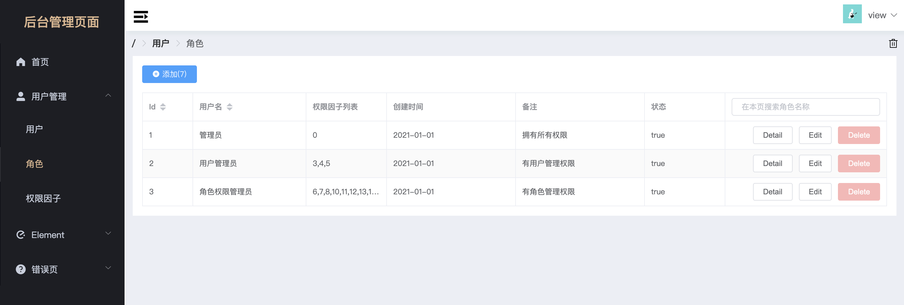
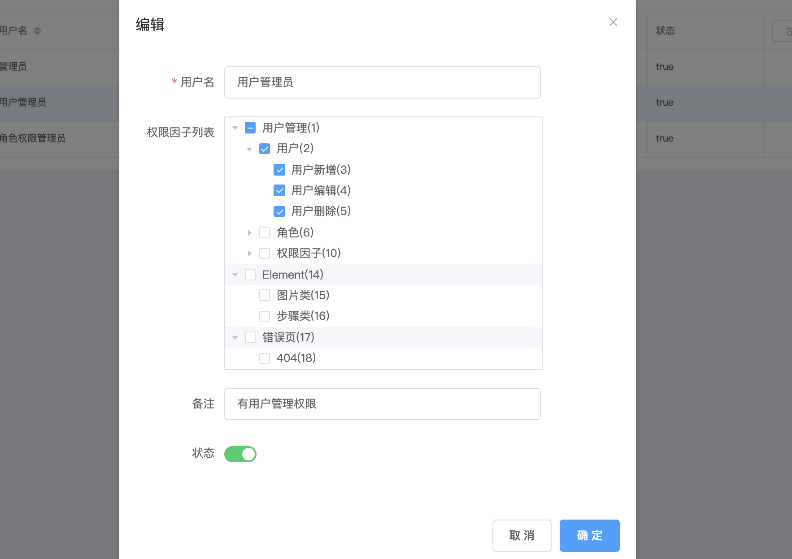
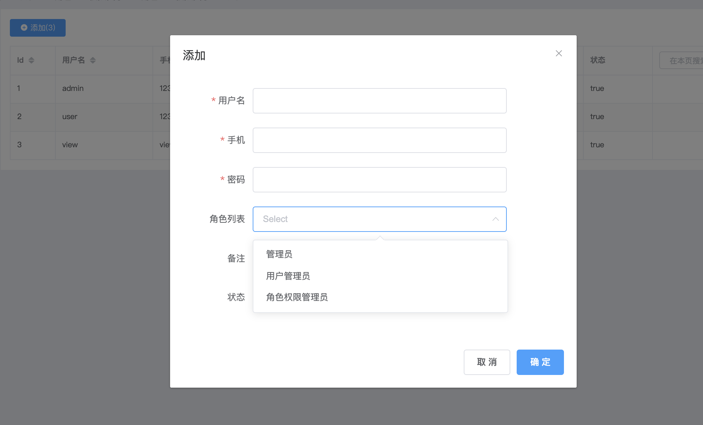
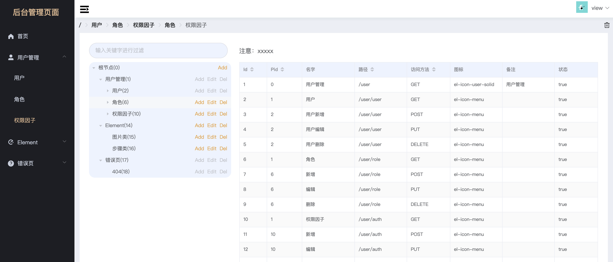

### 一：项目介绍

| 版本   | 更新日期   | 更新内容                          |
| :----- | :--------- | :-------------------------------- |
| v0.0.0 | 2021.02.02 | 项目开始                          |
| v1.0.0 | 2021.02.20 | 初始化前端项目、完成基本页面展示  |
| v1.1.0 | 2021.03.22 | 初始化后端项目、完成 jwt 基础认证 |
| v1.2.0 | 2021.03.23 | 前后端联调，实现基本的登录验证    |
|        |
| v2.0.0 | 2021.03.27 | 升级实现用户/角色/权限关联认证    |

#### 1. 项目说明

```
前端：
vue3 + vuex4 + vue-router4 + elemet-plus1

后端：
gin + gorm + jwt-go + logrus + viper
```

demo: <http://odemo.ohimma.cn>
账号一(拥有所有权限)：admin/1234  
账号二(拥有部分权限)：view/view23







### 二：项目启动

git clone https://github.com/Ohimma/Odemo.git

##### 1. 后端

初始化数据库

```
$ yum install mysql

$ mysql

> CREATE DATABASE odemo DEFAULT CHARACTER SET utf8 DEFAULT COLLATE utf8_general_ci;
> create user 'odemo'@'%' identified by 'odemo123';
> grant all privileges on odemo.*  to 'odemo'@'%';
```

运行项目

```
$ cd gin


测试环境：
$ ENV="dev" && go run main.go
生产环境：
$ ENV="prod" && go run main.go

打二进制包：
$ CGO_ENABLED=0 GOOS=linux GOARCH=amd64 go build -o odemo
$ ENV="prod" && ./odemo

```

#### 2. 前端

```
$ cd web

$ npm install
$ npm run serve

会自己用浏览器打开 localhost:8080
```

### 三：项目结构

一个好的项目结构，可以让人有比较顺心的全局感觉，大家可以找一个适合自己的。

前端参考：<me>

```
├── babel.config.js
├── package-lock.json
├── package.json
├── public
│   ├── favicon.ico
│   └── index.html      // 原始入口页面，不编译
├── src
│   ├── App.vue         // app component 配置 (可以做登陆动画)
│   ├── assets
│   │   ├── css         // 全局css配置，可以被编译
│   │   │   ├── base.css
│   │   │   └── reset.css
│   │   ├── img
│   ├── components      // views调用的组件，业务共用组件放置位置
│   │   └── users
│   │       ├── Detail.vue
│   │       ├── authEdit.vue
│   │       ├── roleEdit.vue
│   │       └── userEdit.vue
│   ├── layout          // 框架布局页面
│   │   ├── admin1.vue
│   │   └── login1.vue
│   ├── main.js         // 项目主入口文件
│   ├── router          // 项目主路由文件
│   │   ├── index.js
│   │   └── modules
│   │       ├── element.js
│   │       ├── public.js
│   │       └── users.js
│   ├── store           // 状态仓库，初始化后放置共用数据，用于其他组件调用
│   │   ├── index.js
│   │   └── modules
│   │       └── layout.js
│   ├── utils           // 公共方法js
│   │   ├── conver.js
│   │   ├── http.js
│   │   └── utils.js
│   └── views           // router 调用的主页面，
│       ├── element
│       │   ├── images.vue
│       │   ├── index.vue
│       │   └── steps.vue
│       ├── public
│       │   ├── 404.vue
│       │   └── home.vue
│       └── users
│           ├── auth.vue
│           ├── index.vue
│           ├── role.vue
│           └── user.vue
└── vue.config.js
```

后端参考一：<https://github.com/jeesonjian/gin-vue>  
后端参考二：<https://github.com/asong2020/Golang_Dream>  
后端参考三：<https://github.com/pengfeidai/gin-app-start>

```
gin
├── Readme.md
├── config
│   └── config.go      // 解析配置文件
├── config_dev.yaml    // dev 配置文件
├── config_prod.yaml   // prod 配置文件
├── controller         // 控制器层、一般用来做前端的数据验证 (我把业务处理都放这了)
│   ├── health
│   │   └── test.go
│   └── user
│       └── user.go
├── go.mod
├── go.sum
├── handler           // 一些 http 处理的功能包
│   └── response.go
├── main.go
├── middleware        // 中间件，主要用于路由访问时先要经过他们
│   ├── header.go
│   ├── jwt.go
│   └── logger.go
├── model             // 数据库初始化、数据库orm的操作
│   ├── initdb.go
│   └── user.go
├── router            // 路由模块
│   ├── health.go
│   └── router.go
├── service           // 大的项目中做业务处理，接收controller校验完的数据，指挥model处理数据库
└── utils             // 通用工具类，一些日常用的功能函数 (我在想可能要handler业合并过来)
    └── crypto.go

```

### 四：其他
